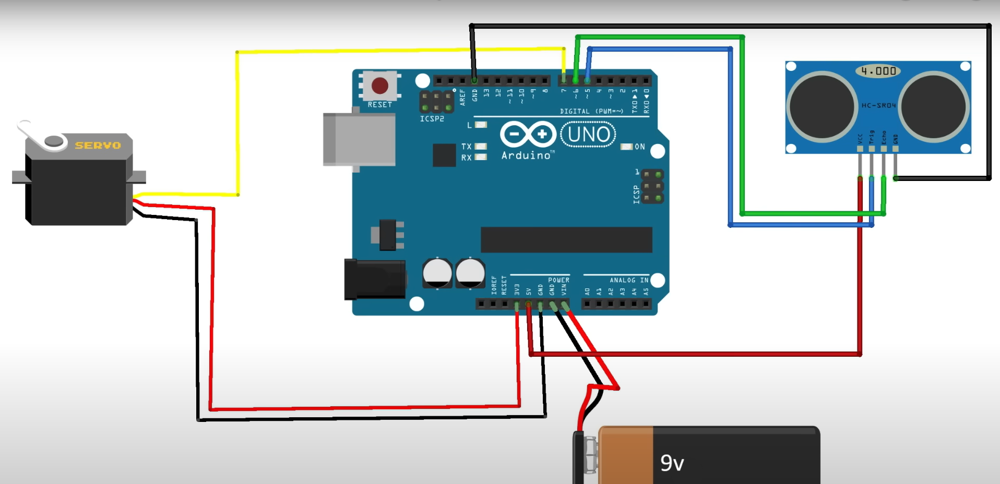

# IoT Based SMART DUSTBIN PROJECT
## About This
Hello! I am Arnab, a 18Y/O High School Student, I made this during my summer vacation after learning some basic Arduino Coding. 

## Things I Used 
<ol>
    <li> Arduino UNO R3
    <li> Servo Motor
    <li> Ultrasonic Sensor 
    <li> Jumper Cables 
    <li> A Basket
    <li> A peice of cardboard 
    <li> A metal ball (recommended; i used a key) 
    <li> A 9V Battery (mine was died so i used direct electricity with phone's charging adapter) 
    <li> Other Tools Like : Glue Gun, Double Sided Tape, A String etc. 
</ol>

## Mindmap

## Resources 
<ol>
    <li>freeCodeCamp.org 's <a href="https://youtu.be/DPqiIzK97K0?si=i-kSIttu3asl6Dkf"> "Aurdino Course for Everybody"</a>
    <li>Indian LifeHacker 's <a href="https://youtu.be/9yrP1CZN3Ds?si=6mP6GmVWudiCevCD"> "Smart Dustbin Tutorial"</a>
    <li>Order all the IoT Parts from <a href="https://www.flyrobo.in/?srsltid=AfmBOoqH5mlvPRNkApC_xZbEOhbSFT6sPlx6xUgf-8e0zz4_WrBJZzga">flyrobo.in</a>
</ol>

## Photos & Videos
<a href="https://youtu.be/jHgLbJLmG4Q?si=2rQSlTZ51nq693iY">Watch this video</a>
   
Thank You! <3
